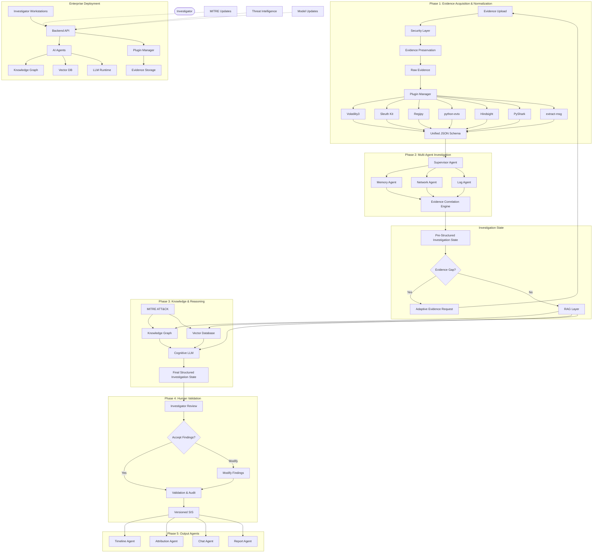

```mermaid
flowchart TD

%% =====================================================
%% SHERLOCKGPT END-TO-END ARCHITECTURE
%% =====================================================

User([Investigator])

%% ===============================
%% Phase 1
%% ===============================

subgraph Phase1["Phase 1: Evidence Acquisition & Normalization"]

Upload["Evidence Upload"]
Security["Security Layer"]
Preserve["Evidence Preservation"]

Evidence["Raw Evidence"]

Plugin["Plugin Manager"]

Volatility["Volatility3"]
SleuthKit["Sleuth Kit"]
Regipy["Regipy"]
EVTX["python-evtx"]
Hindsight["Hindsight"]
PyShark["PyShark"]
ExtractMSG["extract-msg"]

JSON["Unified JSON Schema"]

Upload --> Security
Security --> Preserve
Preserve --> Evidence

Evidence --> Plugin

Plugin --> Volatility
Plugin --> SleuthKit
Plugin --> Regipy
Plugin --> EVTX
Plugin --> Hindsight
Plugin --> PyShark
Plugin --> ExtractMSG

Volatility --> JSON
SleuthKit --> JSON
Regipy --> JSON
EVTX --> JSON
Hindsight --> JSON
PyShark --> JSON
ExtractMSG --> JSON

end

%% ===============================
%% Phase 2
%% ===============================

subgraph Phase2["Phase 2: Multi-Agent Investigation"]

Supervisor["Supervisor Agent"]

Memory["Memory Agent"]
Network["Network Agent"]
Logs["Log Agent"]

Correlation["Evidence Correlation Engine"]

JSON --> Supervisor

Supervisor --> Memory
Supervisor --> Network
Supervisor --> Logs

Memory --> Correlation
Network --> Correlation
Logs --> Correlation

end

%% ===============================
%% Investigation State
%% ===============================

subgraph Investigation["Investigation State"]

PreSIS["Pre-Structured Investigation State"]

Decision{"Evidence Gap?"}

Request["Adaptive Evidence Request"]

Correlation --> PreSIS

PreSIS --> Decision

Decision -- Yes --> Request
Request --> Upload

Decision -- No --> RAG

end

%% ===============================
%% Phase 3
%% ===============================

subgraph Phase3["Phase 3: Knowledge & Reasoning"]

RAG["RAG Layer"]

Knowledge["Knowledge Graph"]

Vector["Vector Database"]

MITRE["MITRE ATT&CK"]

LLM["Cognitive LLM"]

FinalSIS["Final Structured Investigation State"]

RAG --> Knowledge
RAG --> Vector

MITRE --> Knowledge
MITRE --> Vector

Knowledge --> LLM
Vector --> LLM

RAG --> LLM

LLM --> FinalSIS

end

%% ===============================
%% Phase 4
%% ===============================

subgraph Phase4["Phase 4: Human Validation"]

Review["Investigator Review"]

Accept{"Accept Findings?"}

Modify["Modify Findings"]

Audit["Validation & Audit"]

Version["Versioned SIS"]

FinalSIS --> Review

Review --> Accept

Accept -- Yes --> Audit

Accept -- Modify --> Modify

Modify --> Audit

Audit --> Version

end

%% ===============================
%% Phase 5
%% ===============================

subgraph Phase5["Phase 5: Output Agents"]

Timeline["Timeline Agent"]

Attribution["Attribution Agent"]

Chat["Chat Agent"]

Report["Report Agent"]

Version --> Timeline
Version --> Attribution
Version --> Chat
Version --> Report

end

%% ===============================
%% Deployment
%% ===============================

subgraph Deployment["Enterprise Deployment"]

Workstation["Investigator Workstations"]

API["Backend API"]

Agents["AI Agents"]

Plugins["Plugin Manager"]

KnowledgeDB["Knowledge Graph"]

VectorDB["Vector DB"]

EvidenceDB["Evidence Storage"]

Model["LLM Runtime"]

Workstation --> API

API --> Agents
API --> Plugins

Agents --> KnowledgeDB
Agents --> VectorDB
Agents --> Model

Plugins --> EvidenceDB

end

MITREUpdates["MITRE Updates"]
ThreatIntel["Threat Intelligence"]
ModelUpdates["Model Updates"]

MITREUpdates -.-> API
ThreatIntel -.-> API
ModelUpdates -.-> API
```
